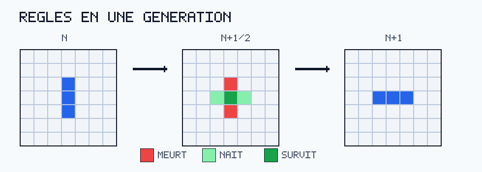
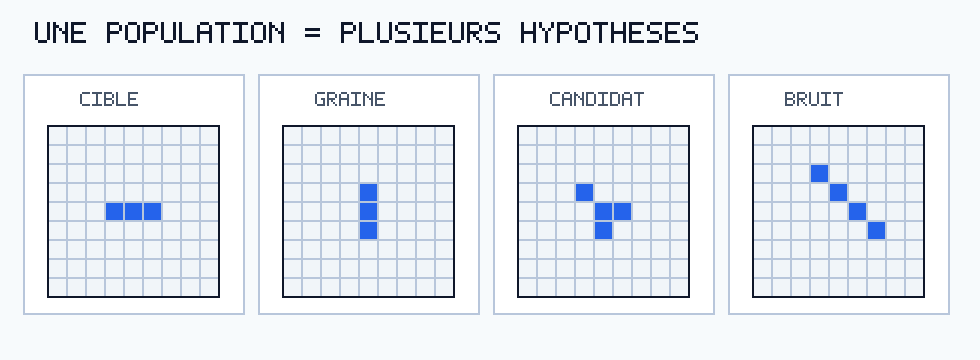
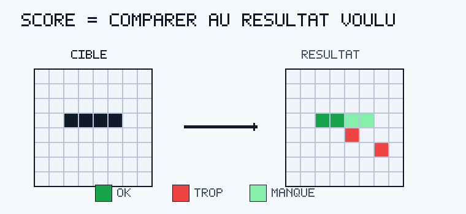
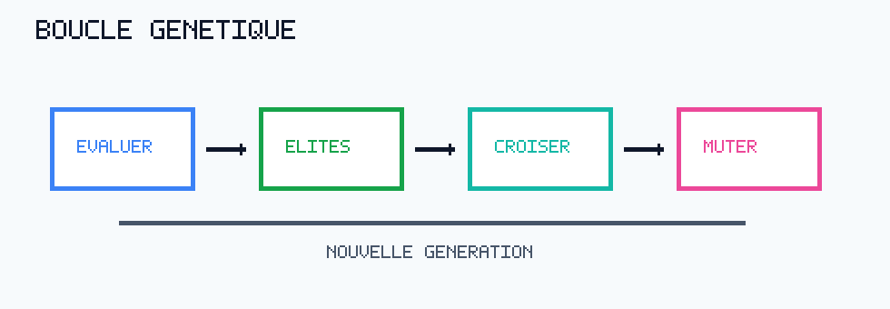
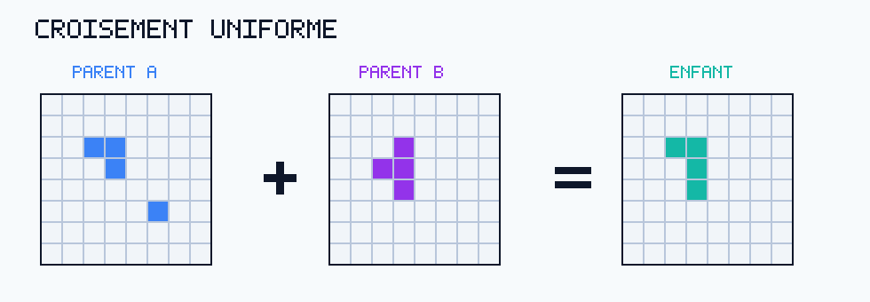
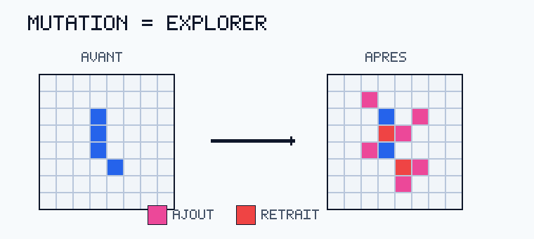

# Script d'oral - Life Pattern Hunter

Durée visée : 10 minutes.

Objectif : expliquer clairement le Jeu de la vie, le problème inverse, l'algorithme génétique et la complexité.

## Slide 1 - Titre

**Message :** on cherche le passé possible d'une grille finale.

**Script :**

Bonjour, je présente Life Pattern Hunter, un projet autour du Jeu de la vie de Conway.

Le principe est inverse : l'utilisateur dessine une grille finale, puis le programme cherche une grille initiale capable de produire cette cible après un nombre donné de **générations du Jeu de la vie**.

Le coeur du projet est un algorithme génétique, et l'objectif principal est d'en expliquer rigoureusement la complexité.

Point de vocabulaire important : dans l'oral, je distingue toujours une génération du Jeu de la vie, c'est-à-dire un passage `n -> n+1`, et une génération génétique, c'est-à-dire une itération complète de l'algorithme sur une population.

## Slide 2 - Règles du Jeu de la vie



**Script :**

Le Jeu de la vie se joue sur une grille de cellules mortes ou vivantes.

À chaque génération du Jeu de la vie, toutes les cellules sont mises à jour en même temps.

Une cellule vivante survit avec 2 ou 3 voisines. Une cellule morte naît avec exactement 3 voisines. Sinon, elle est morte.

Sur le visuel, la grille du milieu est une grille d'explication : rouge signifie que la cellule meurt, vert clair qu'elle naît, vert foncé qu'elle survit.

## Slide 3 - Le problème inverse

**À afficher :**

```text
Trouver G0 tel que simuler(G0, X) ≈ cible
```

**Script :**

La simulation normale est simple : on part d'une grille initiale et on applique les règles vers le futur.

Ici, je fais l'inverse : je connais la grille finale souhaitée, et je cherche un passé possible.

Une grille de 24 par 24 contient 576 cellules. Comme chaque cellule peut être morte ou vivante, une recherche exhaustive testerait `2^576` grilles.

Ce nombre est trop grand. Il faut donc chercher intelligemment, sans tout essayer.

## Slide 4 - Population de candidats



**Script :**

L'algorithme garde une population de grilles initiales candidates.

Chaque candidate est une hypothèse : “et si la grille initiale était celle-ci ?”

Pour l'évaluer, on la simule pendant `X` générations du Jeu de la vie, puis on compare le résultat obtenu à la cible.

Ici, `X` signifie bien `X` générations du Jeu de la vie. Ce n'est pas le nombre d'itérations de l'algorithme génétique.

On ne remonte donc jamais réellement le temps. On teste des passés possibles en avançant vers le futur.

## Slide 5 - Score



**À afficher :**

```text
score = erreur_finale + 0.001 * cellules_initiales
```

**Script :**

Le score est ce qui permet de classer les candidats.

Une cellule cible manquante coûte cher. Une cellule en trop coûte moins cher. Et une cellule en trop loin de la cible ajoute une petite pénalité de distance.

La petite pénalité sur les cellules initiales sert seulement à préférer une solution plus propre quand deux résultats finaux sont presque équivalents.

Plus le score est bas, meilleure est la candidate.

## Slide 6 - Boucle génétique



**Script :**

Le coeur de l'algorithme tient en quatre verbes : évaluer, garder les élites, croiser, muter.

Les élites sont les meilleurs individus de la génération génétique courante. Ils sont conservés tels quels pour ne pas perdre les bonnes solutions déjà trouvées.

Une génération génétique correspond donc à : évaluer toute la population, sélectionner, croiser, muter, puis obtenir une nouvelle population.

Ensuite, on crée des enfants à partir de parents sélectionnés parmi les bons candidats.

Puis on mute légèrement ces enfants pour continuer à explorer.

## Slide 7 - Pseudo-code principal

**À afficher :**

```python
evaluations = evaluer_population(population)
trier_par_score(evaluations)
garder_les_elites(evaluations)

while population_suivante_pas_complete:
    parent_a = selection_tournoi(evaluations)
    parent_b = selection_tournoi(evaluations)
    enfant = croiser(parent_a, parent_b)
    muter(enfant)
```

**Script :**

Ce pseudo-code résume la partie la plus importante.

La sélection par tournoi tire quelques candidats au hasard et garde le meilleur. Cela favorise les bonnes solutions, sans supprimer complètement la diversité.

La nouvelle version du code est volontairement centrée sur cette boucle pour être plus scolaire.

## Slide 8 - Croisement



**Script :**

Le croisement combine deux parents.

Pour chaque cellule de la zone de recherche, l'enfant prend soit la valeur du parent A, soit la valeur du parent B.

Le visuel utilise volontairement un `+` et un `=` : parent A plus parent B donne un enfant.

L'objectif est de recombiner des morceaux de bonnes solutions.

## Slide 9 - Mutation



**Script :**

La mutation inverse quelques cellules.

Dans le vrai algorithme, le taux de mutation est faible. Sur le visuel, l'effet est amplifié pour rendre l'idée évidente : certaines cellules sont ajoutées, d'autres retirées.

La mutation est indispensable parce que le croisement seul ne peut pas inventer facilement une cellule utile absente des deux parents.

## Slide 10 - Aides gardées

**À afficher :**

```text
zone de recherche
carte de distance
cache
graines locales
relance anti-stagnation
nettoyage
```

**Script :**

J'ai simplifié l'algorithme, mais j'ai gardé les aides qui ont un vrai effet sur les résultats.

La zone de recherche limite le bruit loin de la cible.

La carte de distance aide à créer et pénaliser les cellules selon leur proximité avec le motif final.

Le cache évite de resimuler deux fois la même grille.

Les graines locales aident les petites cibles comme le blinker.

Et si la population stagne, on injecte de nouveaux candidats.

## Slide 11 - Complexité d'une évaluation

**À afficher :**

```text
1 génération du Jeu de la vie = O(N)
évaluer un candidat = O(X * N)
```

**Script :**

On note `N` le nombre de cellules du plateau et `X` le nombre de générations du Jeu de la vie simulées pour évaluer un candidat.

Pour calculer une génération du Jeu de la vie, on parcourt toutes les cellules. Chaque cellule regarde au plus 8 voisines, donc le facteur 8 est constant.

Une génération du Jeu de la vie coûte donc `O(N)`.

Simuler `X` générations du Jeu de la vie coûte `O(X * N)`.

Comparer le résultat à la cible parcourt aussi la grille, donc l'ordre de grandeur reste `O(X * N)`.

## Slide 12 - Complexité complète

**À afficher :**

```text
une génération génétique =
O((P + L + R) * X * N + P log P)

recherche complète =
O(G * ((P + L + R) * X * N + P log P))
```

**Script :**

`P` est la taille de population.

`L` est le nombre d'essais d'amélioration locale.

`R` est le nombre d'essais de nettoyage.

`G` est le nombre maximal de générations génétiques.

Donc la formule mélange les deux niveaux : `G` générations génétiques, et dans chacune d'elles, des candidats simulés pendant `X` générations du Jeu de la vie.

Le terme dominant est la simulation répétée des candidats. On peut donc retenir l'idée principale :

```text
O(G * (P + L + R) * X * N)
```

La conclusion est claire : on évite la recherche impossible en `2^N`, mais on paie le prix de tester beaucoup de candidats.

## Conclusion

**Script :**

Pour conclure, le programme transforme un problème inverse très grand en recherche génétique guidée.

L'algorithme est volontairement pédagogique : population, score, élites, croisement, mutation.

La complexité est calculable parce que le coût dominant est toujours le même : à chaque génération génétique, simuler des candidats pendant `X` générations du Jeu de la vie.

Les optimisations comme le cache, la zone de recherche et les graines locales améliorent les résultats pratiques sans rendre l'explication principale confuse.
